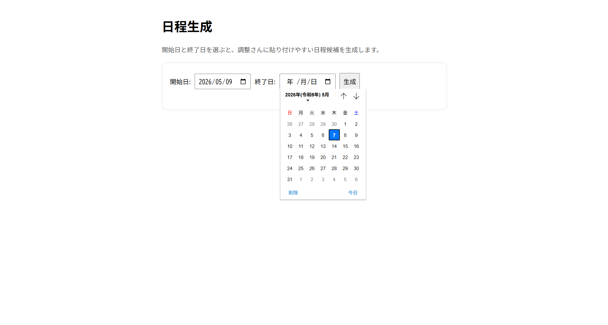
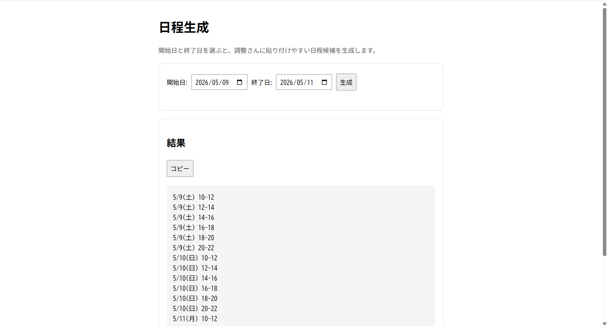

# 日程調整サポートツール

## 概要
日程候補の生成と、調整さんCSVの集計を行うWebアプリです。

開始日〜終了日を指定すると、調整さんへ貼り付け可能な形式で日程候補を自動生成できます。

また、調整さんCSVを読み込むことで、指定人数以上が参加可能な日程の抽出や、連続時間帯の自動結合を行えます。

大学時代のアカペラサークルで実際に感じていた「日程調整の手間」を軽減するために制作しました。

## 制作背景
大学時代、アカペラサークルで長期休暇中の練習日程調整を行う機会が多くありました。

練習候補日は「5/4(月) 10-12」のような形式で、2時間刻みの日程を大量に作成し、調整さんへ手入力していました。

候補日が多い場合は作業量が大きく、入力ミスも起こりやすかったため、日程候補を自動生成できるツールを制作しました。

また、実際の課題を解決するWebアプリを制作し、Python・Flask学習およびポートフォリオ制作につなげることも目的としています。

## 主な機能
- 開始日・終了日を指定して日程候補を生成
- 2時間刻みの日程を自動作成
- 「5/4(月) 10-12」形式で出力
- 調整さんへそのまま貼り付け可能
- 調整さんCSVを読み込み、参加可能人数を集計
- 指定人数以上が参加可能な日程を抽出
- 連続する時間帯の自動結合
- △ / × メンバーの表示
- コピーボタンによる簡単コピー
- 入力内容の保持
- エラー入力時のメッセージ表示
- スマートフォン表示対応

### バックエンド
- Python
- Flask

### フロントエンド
- HTML
- CSS
- JavaScript

### 開発環境
- Visual Studio Code

### インフラ・デプロイ
- Render

### バージョン管理
- Git
- GitHub

## 工夫した点
- 調整さんへそのまま貼り付けできる形式で出力し、実際の運用を意識しました。
- コピーボタンを実装し、日程候補を簡単にコピーできるようにしました。
- 再入力の手間を減らすため、入力内容を保持するようにしました。
- 不正な入力時にはエラーメッセージを表示し、操作しやすいUIを意識しました。
- 同じ参加状況が連続する時間帯は自動で結合し、結果を見やすくしました。
- CSV未選択・入力値不正・CSV形式エラーなど、エラー内容ごとにメッセージを分離しました。
- 実際の運用時の使いやすさを重視し、スマートフォン表示にも対応しました。
- 処理ごとに関数を分割し、保守しやすい構成を意識しました。
- ガード節を用いて入れ子を減らし、読みやすいコードを意識しました。

## 今後の改善予定
- スマートフォン表示の改善
- UIデザインの調整
- 練習可能日の抽出機能
- 参加人数の多い日程のランキング表示
- より柔軟な時間帯設定への対応
- AJAXを用いた画面更新の高速化
- CSV形式エラー時の詳細表示
- 時間帯テンプレート機能

## 公開URL
https://my-project-78uy.onrender.com

## GitHub
https://github.com/kazuki-0630/my_project

## スクリーンショット

### 入力画面

### 生成結果

### スマホ表示
